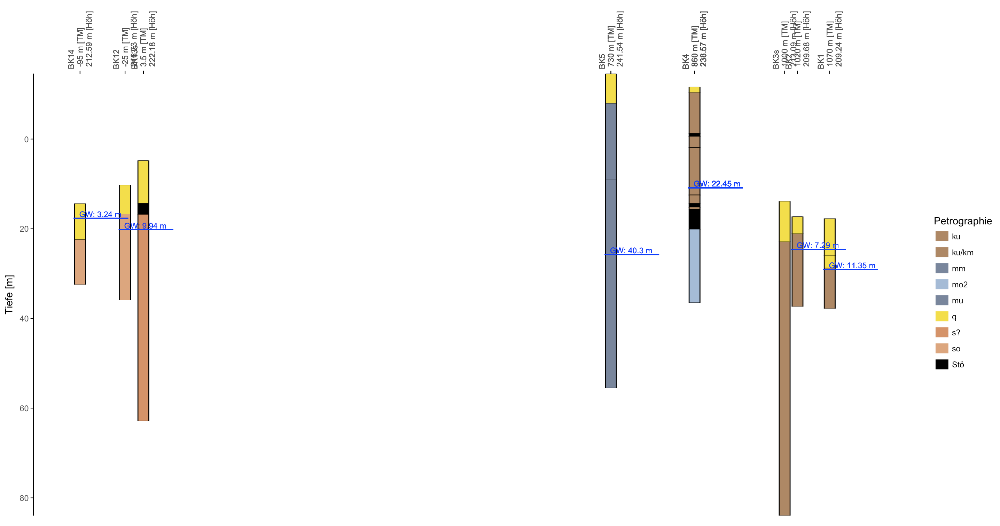
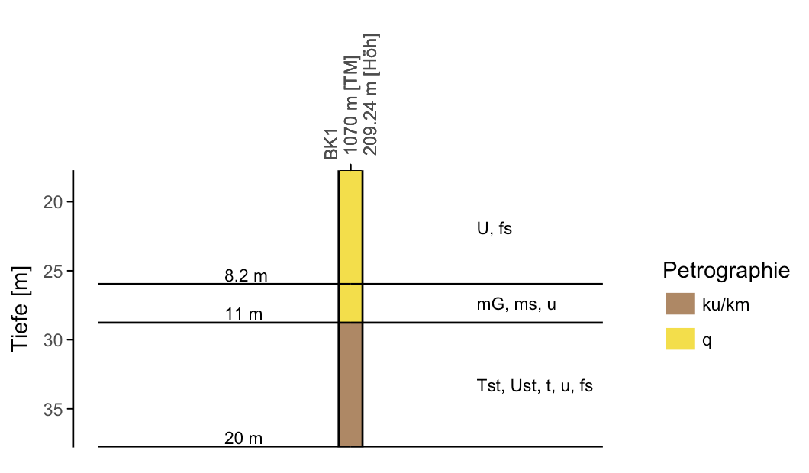
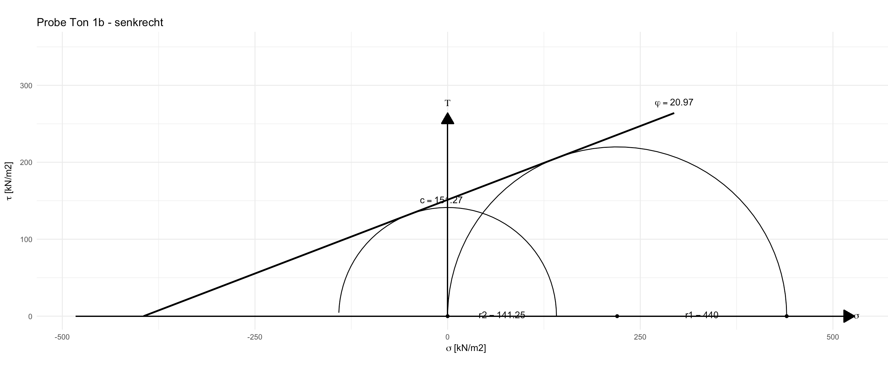

# Geotechnical & Hydrogeologcial R Code Examples, Tools and Functions
This repo contains a series of usable functions to plot and visualize geological and hydrogeological datasets.

### Create Geotechnical Profiles
To create geotechnical profiles (crosssections) run the function `create_profile()`. The function reads in borehole data which has to be stored in a specific formatted excel table. An Example can be found here: [Excel Example File](borehole-template/borehole-data.xlsx).

#### Possible Options:
* Create Only 1 borehole profile
* Create A series / crosssection of borehole-plots with corrected X (e.g. meter from beginning of tunnel) and Z values (Offset from surface)
* Annotate drilling plots with explorated geology
* Add detected groundwater tables
* Add consistency of explorated geological layers
* Add in situ density of explorated geological layers

#### Examples

<div style='float: center'>
  </img>
</div>

<div style='float: center'>
  </img>
</div>

### Mohr Coulumb Circle for "Flügelscherversuch" and "Taschenpenetrometer" Tests
Run following Code to display a nice Mohr-Coulumb Plot:

```r
# Input data for sand:

kN_penetrometer_1b_parallel <- mean(c(325,360,250,450,375))
kN_penetrometer_1b_perpendicular <- mean(c(250,450,440,425,400))

plot <- mohrAuswertung(shear = kN_shear_1b_parallel, penetrometer = kN_penetrometer_1b_parallel, title='Probe Sand 1b - parallel')
```

#### Output Example:
<div style='float: center'>
  </img>
</div>
